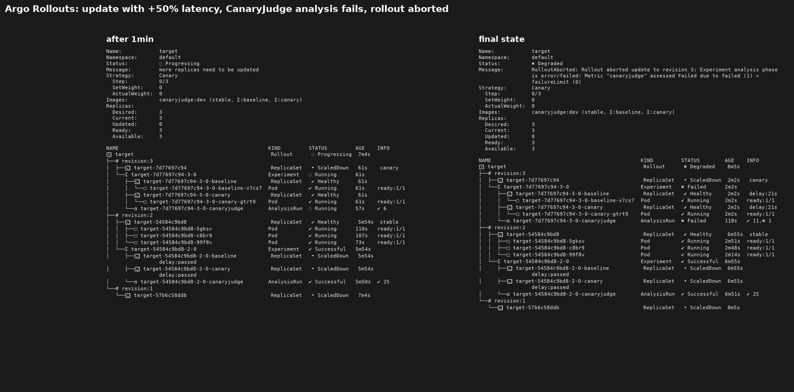
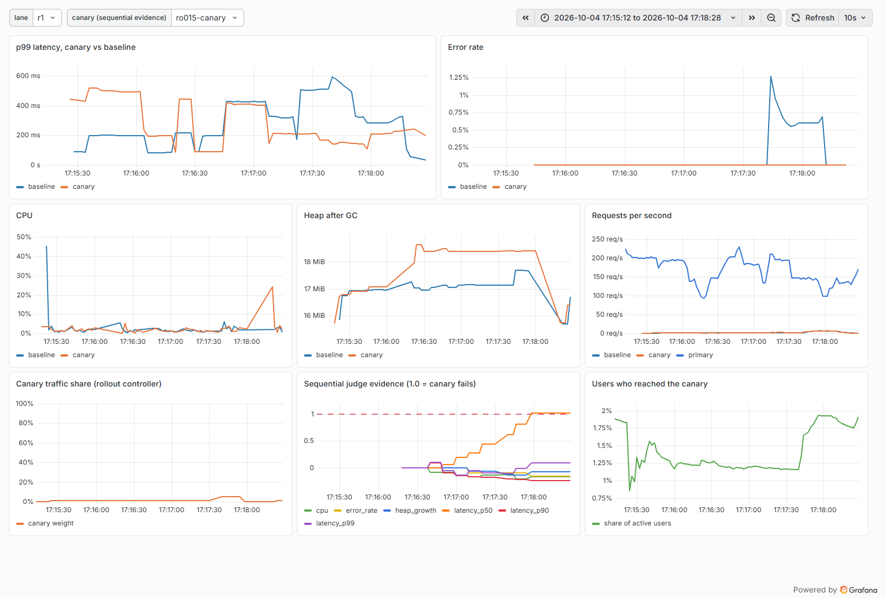

# CanaryJudge

CanaryJudge decides whether a new release is worse than the old one from live metrics, and rolls it back when it
is. It runs a fresh baseline of the old version next to the canary, judges every metric with a Mann-Whitney test
under Kayenta's canary-config semantics (and agrees with Kayenta itself, run from its own image, on every
classification), watches the canary with an always-valid sequential test that stops a bad release in about a
minute without raising the false-alarm rate, and drives a 1% to 5% to 25% rollout that rolls back on its own. It
speaks Kayenta's REST API, plugs into Argo Rollouts as an analysis metric, and ships as a CLI and a GitHub Action.
**What it does not claim:** every number below comes from regressions injected into a small sample service under
generated load on one shared mini PC, with 6-minute canaries and a few runs per regression; none of it is
production traffic or a production canary, and the judge's rules are Kayenta's, not new. Credits are in
[`DESIGN.md`](DESIGN.md).

| Question (live canaries on one mini PC unless noted) | Result |
|---|---|
| Injected regressions stopped within the 6-minute window (38 canaries: latency +2% to +50%, errors, memory leaks, CPU burn) | **sequential judge 82%** (93% without the +2% and +5% latency cases), Kayenta-style judge 74%, static limits with Flagger's defaults 18%, static limits tuned on healthy runs 29% |
| False alarms on healthy canaries (baseline and canary the same build) | **sequential judge 0 of 24**, Kayenta-style judge 0 of 24; the same Mann-Whitney test re-run every interval 4 of 24 (17%); static limits 1 to 3 of 24 |
| Minutes to stop a bad canary | **median 1.3 min** for the sequential judge against 6 min for the fixed-length check |
| Agreement with Kayenta on the same series (58 recorded runs, each judged at 3 window lengths) | **1,044 of 1,044** metric classifications and 174 of 174 canary verdicts, through CanaryJudge's Kayenta-compatible API |
| Live rollouts, 1% to 5% to 25% of users, sequential judge (19 rollouts) | latency, error and CPU regressions rolled back after **at most 3.1% of users** saw them (median 2.8 min); a 4 KB-per-request leak caught once of twice (at 14.4%); a +10% latency regression **missed** in all 3 rollouts; all 4 healthy rollouts promoted |
| Peeking: one test re-run after every interval (synthetic, 2,000 A/A runs per cell) | false alarms climb to **28.5%** after 144 checks; the sequential test stays at **1.4%** |
| Argo Rollouts on k3d (GitHub Actions runner) | a +50% latency update **aborted after 122 s**; a healthy update promoted |

Every figure is in [`NUMBERS.md`](NUMBERS.md) with the `results/*.jsonl` file it came from. The story behind them,
including what lost, is in [`docs/WRITEUP.md`](docs/WRITEUP.md).


**Where it loses.** Small latency regressions (+2%: 0 of 4; +5%: 4 of 5) are below what 6 minutes of 10-second
intervals can resolve on a noisy shared box. At 1% and 5% of traffic, a +10% latency regression never gathered
enough evidence before promotion. Memory had to be judged by growth per interval, which misses slow leaks inside a
6-minute window (bugs 2, 5 and 6 in [`BUG_LOG.md`](BUG_LOG.md)). The sequential test's guarantee assumes
independent intervals; with lag-1 autocorrelation 0.3 its false-alarm rate in simulation reaches 8.6% after 144
checks, and averaging 3 intervals per step brings it back to 2.6%.

## How it works

```
 load generator --> splitter --+--> primary  (old version)
 (open loop,       (by user or  +--> baseline (old version, fresh)      Prometheus <-- CanaryJudge
  Zipf users,       request)    +--> canary   (new version, fresh) --> (2 s scrapes)    judge, sequential judge,
  replayable)                                                                           rollout controller
```

* **Judge** (`core/`). Per metric: NaN handling, optional outlier removal, a 98% confidence interval for the shift
  canary minus baseline from the rank-sum test, a tolerance band and an effect-size threshold, direction, critical
  metrics; then weighted group scores and pass/marginal thresholds. Kayenta's canary config JSON loads unchanged.
* **Sequential judge** (`core/sequential`). A sequential t-test with a closed-form Bayes factor (a test martingale
  under the null) for latency, CPU and memory, and a rate-ratio e-process for errors, each at alpha/m, so the
  canary's false-alarm budget holds at 5% however often it is checked.
* **Server** (`server/`). Kayenta's canary API (`/canaryConfig`, `/metricSetPairList`, `/judges/judge`, `/canary`),
  a polling endpoint for rollout tools (`/api/v1/judge`), and the rollout controller (`/api/v1/rollouts`).
* **Target and traffic** (`target/`, `traffic/`). The sample service with a regression injector (latency, errors,
  a memory leak, CPU burn, each with a size and an onset), the splitter, the open-loop load generator, which can
  replay a public request-rate trace (NASA-KSC web server, July 1995).
* **Experiments** (`bench/`). Live trials recorded from Prometheus and replayed through every judge, the Kayenta
  differential test, live rollouts, the A/A simulation, `ledger.py` and `charts.py`.

Run it: [`docs/USAGE.md`](docs/USAGE.md). Design and credits: [`DESIGN.md`](DESIGN.md). Every bug found on the
way, with what found it: [`BUG_LOG.md`](BUG_LOG.md).

## Integrations

* **Kayenta-compatible API.** A client written for Kayenta's `/canary` and `/judges/judge` endpoints works against
  CanaryJudge; the differential test drives both servers with the same client.
* **Argo Rollouts.** `deploy/argo/` has an `AnalysisTemplate` whose web metric polls CanaryJudge every 10 s, and a
  `Rollout` whose updates first run an experiment with a fresh baseline and a fresh canary. `scripts/argo_demo.sh`
  (run by the `argo-demo` workflow on a k3d cluster) promoted a healthy update and aborted one with +50% latency
  after 122 s:

  
* **CLI and GitHub Action.** `canaryjudge judge --baseline b.csv --canary c.csv` exits 0, 1 or 2 for pass, fail
  or marginal; `action.yml` wraps it so a workflow can gate a deploy step on the verdict. CI runs the action on a
  recorded healthy canary (passes) and a recorded 25% latency regression (blocked).
* **Grafana.** `deploy/grafana/` provisions a dashboard: canary against baseline on every metric, the canary's
  traffic share, the sequential judge's evidence against its threshold, and the share of users reached. Here
  during a live rollout with +50% latency, rolled back during the 5% step:

  

## Testing

* Statistics checked against scipy golden values (normal CDF, tail and quantile to 1e-12; Mann-Whitney p-values,
  asymptotic and exact, on 300 random cases with and without ties) and with property tests (jqwik): the exact
  null distribution against brute-force enumeration, rank invariance, symmetry, interval shift equivariance, and
  that the interval ends sit exactly where the test flips.
* Monte Carlo tests that both sequential tests keep false alarms under 5% over 200 checks.
* The Kayenta differential test in Testcontainers in CI on recorded runs, and on all 58 recordings in the
  `kayenta-diff` workflow.
* CI re-judges every committed recording and checks the results match the committed `results/` rows.

## Where it ran

The live canaries (exp1 to exp3) ran in WSL2 (2 vCPU, 6 GB) on a shared mini PC (AMD Ryzen 3 4300U, 16 GB). Midway,
WSL on that box became unusable (it hung whenever it was under load, for this project and another one sharing
it), so the rollouts (exp5) and the trace replay ran as native Windows processes on the same mini PC (a second A/A
set was attempted there and abandoned when other jobs saturated the host), and the full Kayenta comparison and
the Argo demo ran on GitHub Actions runners. Every results row names its machine and records the host load.
