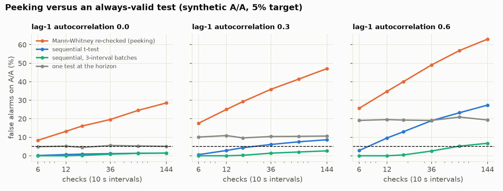
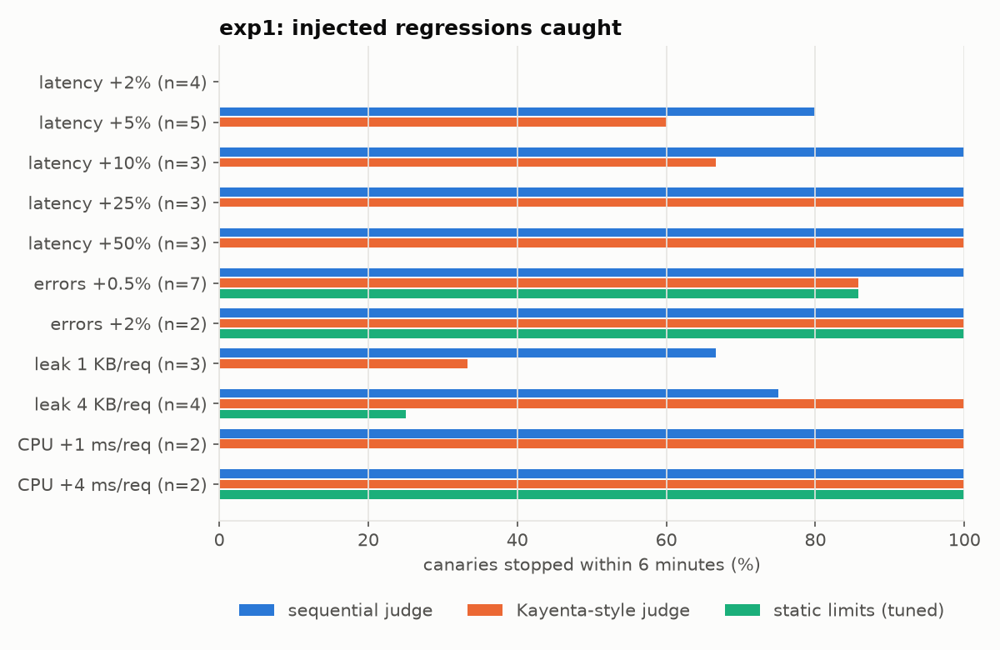
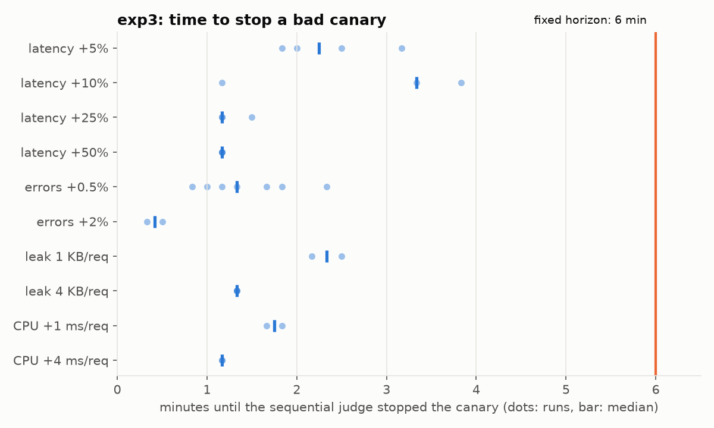

# Judging a canary: rank tests, peeking, and how fast a bad release can be stopped

*A walk through CanaryJudge: what it does, the statistics underneath, what the measurements say, and what
did not work. Every number below is in [`NUMBERS.md`](../NUMBERS.md) with the results file it came from.*

## The problem

A release that passes every test can still be worse in production: slower for some requests, a little more
error-prone, leaking memory, burning more CPU. The usual defense is a canary. Send a slice of traffic to the new
release, compare it with the old one on live metrics, and roll back if it is worse. Two questions make that hard.

1. **Is it worse, or is that noise?** Two identical instances on the same machine do not produce the same
   numbers. Latency quantiles jump around from interval to interval, a garbage collection lands on one instance
   and not the other, a neighbor on the host takes the CPU for a minute.
2. **How long do you wait?** Waiting longer gives more evidence but exposes more users to a bad release.
   Checking early and often is natural, and it quietly breaks the statistics.

In short: on 38 live canaries with injected regressions, the sequential judge stopped 82% of them, in a median of
1.3 minutes against the 6 minutes a fixed-length check waits, and raised no false alarms on healthy
canaries. The fixed-horizon judge, written from Kayenta's documentation, agrees with Kayenta itself on all 1,044
metric classifications it was compared on. Static limits, the most common alternative, caught 18% to 29%.

## How the judge decides

CanaryJudge follows the rules of Kayenta, the open-source canary judge from Netflix and Google that Spinnaker
uses. Each metric is a series of values, one per 10-second interval, for the baseline and for the canary. The
judge asks one question per metric: do the canary's values tend to be larger (or smaller) than the baseline's?

**A rank test, not a t-test.** Per-interval latency is skewed and spiky. A single slow interval can move a mean
and blow up a variance, which either hides a real shift or invents one. The Mann-Whitney test only uses the
order of the values: it counts how often a canary value beats a baseline value. It needs no normality and
ignores how far out the spikes are.

**A confidence interval, a tolerance band and an effect size.** Rather than a bare p-value, the judge builds a
98% confidence interval for the shift between the two series, by inverting the rank test. A metric is High only
if that whole interval sits above a band of 25% of the estimated shift, and the ratio of means is at least the
configured allowed increase. The band keeps tiny but consistent differences from failing a canary; the effect
size lets an operator say "a 10% rise in memory is fine".

**Groups, weights and critical metrics.** Metrics sit in weighted groups (here Latency 40, Errors 40,
Saturation 20). A group's score is the share of its metrics that passed; the canary's score is the weighted
sum. A metric marked critical (errors, here) fails the whole canary outright. A score of 95 or more passes.

I wrote the judge in Java from Kayenta's documentation, then checked it against Kayenta itself: Kayenta's own
image judges the same recorded series through its API, and every classification is compared.

Kayenta judged the 58 recorded runs, each at three window lengths (2, 4 and 6 minutes), through its own
`/judges/judge` endpoint, and CanaryJudge judged the same series through its Kayenta-compatible API. All 1,044 metric
classifications and all 174 canary verdicts matched, and the scores were identical. 118 of those classifications
were not Pass, so the agreement covers failures, not just the easy passes. The one place I deliberately differ,
finding the confidence-interval ends exactly instead of with a numeric root finder, never changed a verdict.

## Why start the baseline with the canary

The obvious comparison is the canary against the production fleet. It is wrong in ways that are easy to miss.
The fleet has been running for days: its JIT has compiled the hot paths, its heap has settled, its caches are
warm. A canary that just started is slower and leaner for reasons that have nothing to do with the code change.
So every canary here gets its own baseline: a fresh instance of the old version, started at the same moment,
given the same share of traffic. Whatever start-up does to one, it does to the other.

Even that is not enough for memory. The first A/A run (two identical builds) failed on heap usage: the canary
used 44% more heap on average. Heap saws up and down with every collection, and leftover start-up garbage stays
until a full collection, which each JVM runs at its own moment. Switching to heap after collection, with a full
collection at start-up, still left identical JVMs 8% to 15% apart, because the old generation fills at its own
pace in each process. The fix was the one Kayenta provides for exactly this: an effect-size floor of 25% on
memory. It costs sensitivity to small leaks, and the results show how much.

## Peeking, and the fix

A canary is watched while it runs. The natural thing is to run the test every interval and stop as soon as it
says the canary is worse. That is peeking, and it inflates false alarms: a test at 5% is a 5% chance of a false
alarm *each time it is run*, and noise has many chances to cross the line.

A simulation makes the size of the problem concrete: 2,000 healthy canaries per setting, one metric,
alpha 5%. A single Mann-Whitney test at the end raises a false alarm 5.1% of the time, as it should. The same test
re-run after every 10-second interval raises one 13% of the time after 12 checks and 28.5% after 144. The
sequential test, checked just as often, stays at 1.4%.

The sequential judge is built to be checked after every interval. For latency, CPU and memory it runs a
sequential t-test on the per-interval differences (canary minus baseline, on a log scale for latency). The
evidence is a Bayes factor whose prior on the noise scale makes it a *test martingale* when the canary is
healthy: its expected value never grows, so by Ville's inequality the chance it ever reaches 20 is at most 5%,
however long you watch. For errors it uses an e-process on counts: given how many errors happened in an
interval, the canary's share of them is binomial, with a probability set by the two sides' traffic and the ratio
of their error rates. Six metrics each run at 5%/6, so the whole canary keeps a 5% false-alarm budget.

The guarantee assumes the per-interval differences are independent. Real metrics are autocorrelated: a slow
interval tends to be followed by another. The simulation shows what that does, and the A/A canaries measure it
on live data.

## What the measurements say

**Detection.** 38 live canaries carried one of eleven regressions. The sequential judge stopped 82% within the
6-minute window, and 93% once the two smallest latency regressions are left out; the Kayenta-style judge stopped 74%
(86%). The sequential judge caught every error-rate and CPU regression; the Kayenta-style judge missed one of seven
+0.5% error runs. Latency +25% and +50% were always caught, +10% by the sequential judge every time and by the
Kayenta-style judge 2 of 3 times, +5% in 4 of 5 and 3 of 5 runs, and +2% never. Static limits did far worse: Flagger's defaults (p99 under 500 ms, success rate over 99%) never fired on a
latency regression, because this service's p99 is about 70 ms, and limits tuned on healthy runs caught 29% overall.
A fixed limit only sees a canary that crosses an absolute line; a comparison with a baseline sees a canary that is
worse than it should be.

**False alarms.** Across 24 healthy canaries (18 in the main set, 6 under the replayed NASA traffic shape) the sequential judge
raised no false alarm, and neither did the Kayenta-style judge. Re-running the Mann-Whitney test every interval, on the same healthy runs, raised
3 false alarms in 18. The per-interval differences turned out to be close to independent for latency (lag-1
autocorrelation between -0.03 and +0.04), which is why the sequential guarantee held on live data; for memory
growth it was -0.41, which errs on the safe side.

**Time.** Over the runs it caught, the sequential judge stopped the canary in a median of 1.3 minutes: 0.4 minutes
for 2% extra errors, about 1.2 for +25% and +50% latency and +4 ms of CPU per request, 2.2 and 3.3 minutes for +5% and
+10% latency. The fixed-horizon judge always waits the full 6.

**Rollouts.** The controller moved fresh canaries through 1%, 5% and 25% of users, 2 minutes per step, with users
pinned to a side by a hash of their id. With the sequential judge, every latency (+50%), error and CPU regression was
rolled back after at most 3.1% of users had reached the canary, a median of 2.8 minutes in. The 4 KB-per-request
leak was caught once at the 25% step (14.4% of users) and missed once. A +10% latency regression was missed in all
three rollouts: at 1% and 5% of 200 requests per second, two minutes is not enough evidence. All four healthy
rollouts were promoted. For comparison, a manual canary at 5% for 30 minutes exposes 5% of users when it is
caught and everyone when it is missed.

## What lost, and why

* **Small regressions.** +2% latency was never caught and +5% only sometimes. On a shared 2-vCPU box the
  per-interval noise is larger than that; a longer window or per-request latency data would be needed.
* **Low-traffic steps.** The rollout's 1% and 5% steps carry about 2 and 10 requests per second; a +10% latency
  regression slipped through all three times. Longer steps, or a higher minimum traffic share for analysis,
  would fix it at the cost of exposure.
* **Memory.** Heap level is not a canary metric: identical JVMs differed by 30% depending on what start-up promoted
  into the old generation. Judging heap growth per interval works, but only for leaks fast enough to show in a few
  minutes; the 1 KB-per-request leak was caught two times in three.
* **Autocorrelation.** The sequential t-test assumes independent intervals. In simulation, lag-1 autocorrelation of
  0.3 lifts its false-alarm rate to 8.6% after 144 checks; averaging three intervals per step brings it to 2.6%.
  The live latency series were close to independent, so it held here, but a production version should batch.
* **The box.** Halfway through, WSL on the shared mini PC started hanging under load and had to be restarted
  repeatedly (it took another project's runs down with it, too). The rest of the live work ran as native Windows
  processes on the same machine, and two compute-only steps ran on GitHub Actions. Each results row says where.

## How it was measured

All of it ran on one shared mini PC (AMD Ryzen 3 4300U, WSL2 with 2 vCPUs and 6 GB), with other jobs on the
same box; every run records the host load. Each live canary is a fresh baseline and canary of a small Spring Boot
service, behind a splitter, under an open-loop load generator, scraped by Prometheus every 2 s. Regressions are
injected into the canary. The recordings are replayed through every judge, so all of them see the same numbers.
None of this is production traffic, and a 6-minute window on one machine is not a production canary.
